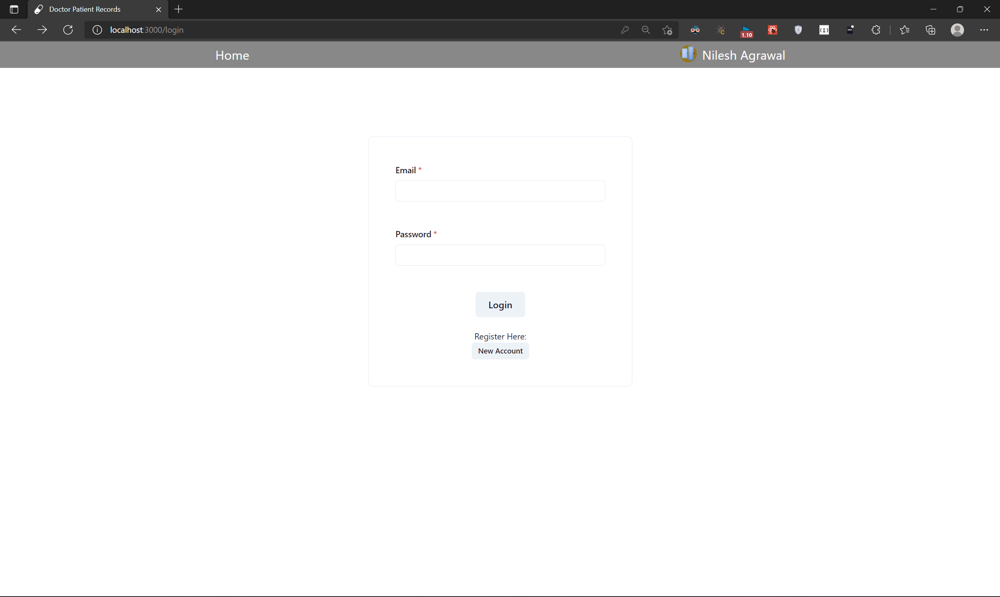
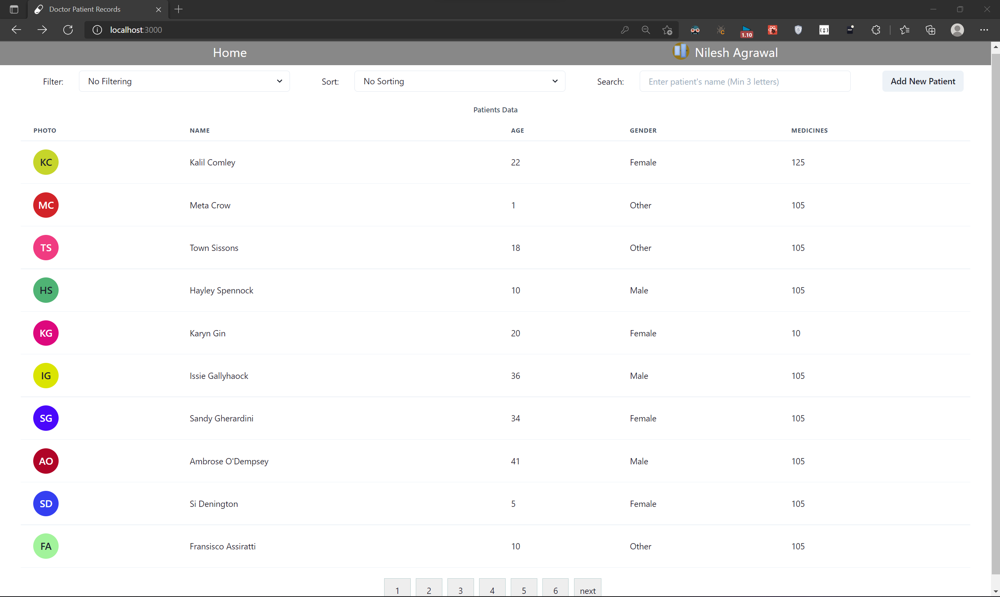
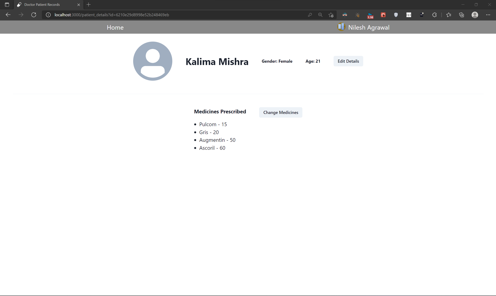

# Doctor Patient Records

A web application with complete front and back end which manages records of patients with their basic details and medicines prescribed.

## Features
- Login for doctors.
- Main page shows all the patient under a doctor after doctor logins.
- Filter by gender and sort by age or name.
- Search patients by name.
- See patients details with name and quantity of medicines prescribed to them.
- Add or edit patient.
- Add/Edit/Remove medicines for a patient.
- Backend pagination.

## TechStack
- React
- Express
- Mongoose
- Chakra UI

## Screenshots

- Login Page: 

- Home Page: 

- Patient Details Page: 

